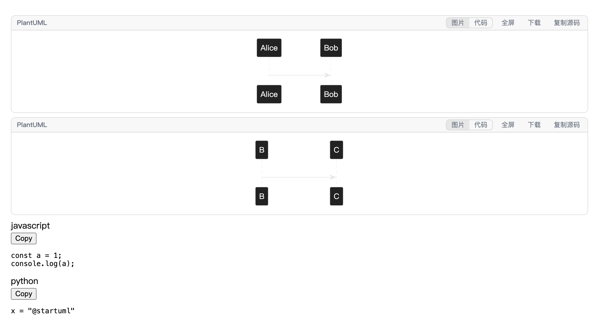
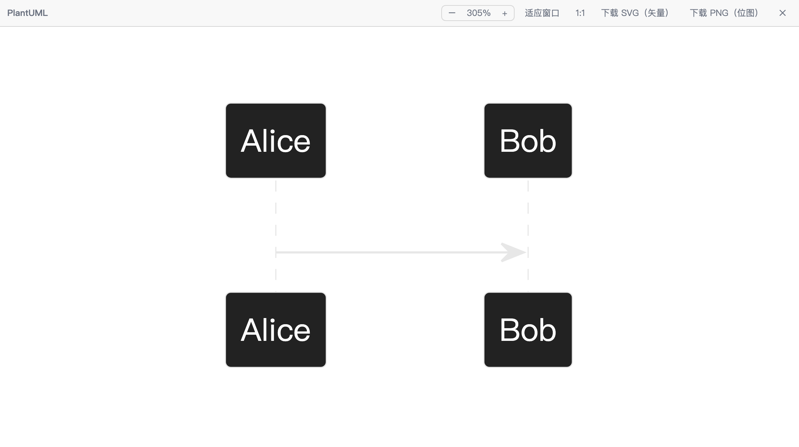
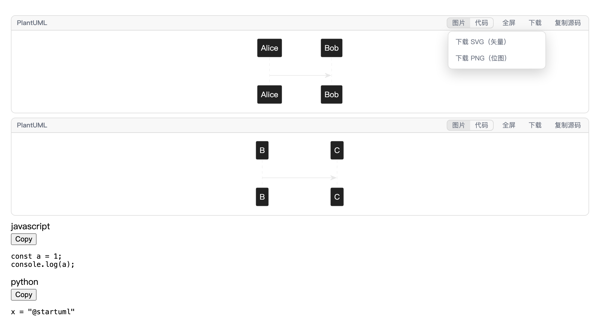

# dsh-plantuml

Render PlantUML diagrams inline in the DSH chat, with a fullscreen viewer,
zoom, and SVG/PNG download. Every ` ```plantuml ` fence in a session becomes a
live diagram, and each one carries a **图片 / 代码** (diagram / source) switch so
the original text is always one click away.

Rendering happens **entirely in the browser** — no Java, no PlantUML server, no
network round trip.

```
┌────────────────────────────────────────────────────────┐
│ PlantUML          [ 图片 | 代码 ]  全屏  下载  复制源码 │
├────────────────────────────────────────────────────────┤
│                                                        │
│      Alice ────────────► Bob: hello                    │
│      Alice ◄──────────── Bob: hi                       │
│                                                        │
└────────────────────────────────────────────────────────┘
```

## What it does

- Renders any fence tagged `plantuml`, `puml`, `uml`, `iuml`, `pu`, or `wsd`.
- Also renders a **languageless** fence when its text contains a real
  `@start…` / `@end…` pair, so pasted diagrams without a language tag still work.
- Switches per block between the rendered diagram and the exact source, with a
  copy button for the source.
- **Fullscreen viewer** (the 全屏 button, or click the diagram) with zoom in/out,
  fit-to-window, 1:1, drag-to-pan, and ctrl/⌘-wheel zoom.
- **Download as SVG (vector) or PNG (raster)** from the 下载 menu.
- Re-renders when you change the app theme, so diagrams match light and dark.
- Works in the chat transcript, tool results, and every other Markdown surface
  the app renders — the diagrams are found wherever the app draws a code block.

Nothing is sent anywhere: the engine and its standard library are served from
this package by the local DSH process.



### Fullscreen viewer controls



| Control | Action |
|---|---|
| `−` / `+` | Zoom out / in by one step, anchored on the viewport centre |
| 适应窗口 | Fit the diagram to the window (never enlarging past 100%) |
| 1:1 | Actual size |
| ctrl/⌘ + wheel | Zoom around the pointer (trackpad pinch works too) |
| drag | Pan |
| `+` / `-` / `0` / `f` | Zoom in / out / actual size / fit |
| `Esc` or ✕ | Close |

### Download



Downloads carry their own background, so a diagram drawn for the dark theme
stays readable when the file is opened or pasted onto a white page (compare
[the exported PNG](docs/exported-png.png) — a dark-theme diagram with a real
background). The file name comes from the diagram's `@startuml <name>` when it
has one.

### Export limits

- PNG is rasterized at 2× and clamped to 8192 px per side (the universally safe
  canvas box). SVG has no such limit.
- A diagram that embeds external images can taint the canvas and fail PNG
  export; the viewer says so and suggests SVG.


## Install

The package is already wired into the `desktop` profile. To do it again from
scratch:

1. Put this directory at `~/.dsh/plugins/dsh-plantuml`.

2. Make the package resolvable from the profile tree:

   ```sh
   ln -s ~/.dsh/plugins/dsh-plantuml ~/.dsh/profiles/node_modules/dsh-plantuml
   ```

3. Add the loader row to `~/.dsh/profiles/desktop/cordis.patch.yml`:

   ```yaml
   - insert:
       - id: dsh-plantuml
         name: dsh-plantuml
   ```

4. Reload the Harness page. (The row is applied by the running process as soon
   as the file changes; the page needs a reload to pick up the new browser
   bundle.)

To remove it, delete the `insert` block and the symlink, then reload.

## How it works

Two halves, both required.

**Node half** (`lib/index.js`) serves the vendored engine from
`/dsh-plantuml/**` over the composition's `webServer`. The route is confined to
`vendor/`, only serves known script/content extensions, and answers with a
revalidation-friendly `ETag`. It is deliberately unfenced, matching the
existing `/plugins` route that serves every client bundle: a fence demanding an
`Origin` header would reject plain same-origin ESM `<script>`/`import()` GETs.
What it exposes is only the PlantUML engine this package ships — no workspace
file is reachable, and containment is checked on the resolved absolute path.

**Browser half** (`lib/client.js`) renders the diagrams.

The Markdown pipeline turns every fence into a `CodeBlock` that hardcodes its
own body and exposes no render hook, so no slot or prop can turn a fence into a
diagram. This plugin therefore attaches at the DOM seam:

1. A `MutationObserver` watches for `.md-code-block` elements.
2. For each one that holds PlantUML, it **keeps the React-owned element in
   place but hides it** — React stays the sole owner of that subtree and may
   keep streaming into it freely — and inserts its own sibling surface after it.
3. That surface is treated as a pure function of the block's current source, so
   a streaming update, a re-render, or a virtualization remount all converge on
   the right diagram without ever fighting React for a node.

Detection reads the fence's real `code`/`lang` from React's fiber, because the
rendered DOM does not carry the info string: `CodeBlock` drops the
`language-*` class and shows a generic label for grammars it cannot highlight,
and PlantUML is not a syntax-highlighting grammar. When the fiber is
unavailable the DOM text is used instead.

Renders are debounced (streaming coalesces into one render once the text
settles), serialized (the engine keeps global state and lays out
asynchronously), memoized per source and theme, and sanitized before insertion.

The fullscreen viewer renders a **clone** of the block's SVG into a
body-level overlay, so zooming and panning never disturb the inline diagram.
Exports clone that SVG again; both formats are generated from the same
standalone markup, differing only in whether it is rasterized through a
canvas. The menu is positioned fixed and measured after unhiding, because the
inline surface sits inside the block's clipped, rounded box.

## Requirements and limits

- **No Java, no server, no network.** The engine is the official
  TeaVM-compiled build that PlantUML ships for its browser extension. Class,
  component, deployment, state, and use-case diagrams are laid out by Smetana,
  PlantUML's own port of the Graphviz algorithms, which is compiled into the
  same file.
- **Fences are detected heuristically.** A block is PlantUML when its info
  string names PlantUML, or when its text contains a matched
  `@start…`/`@end…` pair. A non-PlantUML block that happens to contain both
  would be rendered as a diagram; switch it to 代码 to read it as text.
- **A render holds the queue for at most 20 seconds**; a pathological diagram
  fails visibly instead of blocking later ones.
- **The `@start…`/`@end…` delimiters are recommended.** They are what makes a
  languageless fence detectable, and they are the only form the engine accepts
  for some diagram types.
- **The viewer is a body-level overlay.** It takes over the screen with a focus
  trap and locks page scroll while open; `Esc` and ✕ both close it, and plugin
  teardown closes it too.
- **Ctrl/⌘-wheel is intercepted inside the viewer** for zoom. That is the
  gesture's conventional meaning in a zoomable canvas, and a plain wheel still
  scrolls.

## License

[MIT](LICENSE) © dlutcat.

## Third-party software

The engine under `vendor/` is PlantUML's own build, redistributed under the MIT
license. See [NOTICE.md](NOTICE.md).
